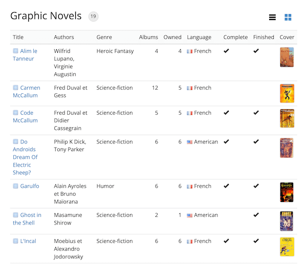

# Evolutility-UI-React &middot; [](https://github.com/evoluteur/evolutility-ui-react/blob/main/LICENSE) [](https://www.npmjs.com/package/evolutility-ui-react)


Evolutility-UI-React is a set of **model-driven views** to [Browse](#Browse), [Edit](#Edit), [List](#List), [Cards](#Cards), [Charts](#Charts), and [Stats](#Stats).

With it you can easily build CRUD applications by writing models rather than code. It uses [Hasura](https://hasura.io) GraphQL backend. No hand-coding is necessary!


### Table of Contents
1. [Installation](#Installation)
2. [Configuration](#Configuration)
3. [Views](#Views) for [One](#ViewsOne) or [Many](#ViewsMany) records
4. [Models](#Models)
5. [Backend](#Backend)
6. [License](#License)

<a name="Installation"></a>
## Installation

[**Download**](https://github.com/evoluteur/evolutility-ui-react/archive/master.zip) or **clone** from [GitHub](https://github.com/evoluteur/evolutility-ui-react/).

```bash
# To get the latest stable version, use git from the command line.
git clone https://github.com/evoluteur/evolutility-ui-react
```

or use the [npm package](https://www.npmjs.com/package/evolutility-ui-react):

```bash
# To get the latest stable version, use npm from the command line.
npm install evolutility-ui-react
```


In the Evolutility-UI-React directory, use the command line to type the following:

```bash
# Install dependencies
npm install

# Run the node.js server
npm start

```

In a web browser, go to the url [http://localhost:3000/ the REST endpoints, you also need to install and run [Evolutility-Server-Node](https://github.com/evoluteur/evolutility-server-node) which provides the matching REST endpoints based on the same metadata.


<a name="Configuration"></a>
## Configuration

Configurations options are specified in the file [/src/config.js](https://github.com/evoluteur/evolutility-ui-react/blob/main/src/config.js). They apply to all apps (app specific options are specified in models).

| Option     | Description      | Example             |
|------------|------------------|---------------------|
| apiPath    | Path to GraphQL API. | "https://myapp.hasura.app/v1/graphql" |
| adminSecret | Token for Hasura. | |
| filesUrl   | Path to upload files to. | "/pix/" |
| pageSize   | Page size in pagination.  | 50 |
| queryModels | Get models from JSON files or from the database through the API. |
| withTimestamp | Tracks and shows timestamp for creation date and last update for every record. The DB tables need timestamp columns "u_date" and "c_date" for the feature to work. | true |
| withActivity | Tracks and shows records activity (last visited and most visited). Currently implemented w/ the browser's localStorage, it will be moved to the server later. | true |


<a name="Views"></a>
## Views

For any object, a single model defines UI elements across views in a simple declarative way.

Evolutility-UI-React provides different types of view:

* Views for One - a single record: [Browse](#Browse), [Edit](#Edit).
* Views for Many - a collection of records: [List](#List), [Cards](#Cards), [Charts](#Charts), [Stats](#Stats).

Evolutility uses GraphQL with [Hasura](https://hasura.io).

Notes: Views for actions (search, filter, export) will come later.


<a name="ViewsOne"></a>
## Views for One object

[Browse](#Browse) - [Edit](#Edit)

<a name="Browse"></a>
### Browse
Shows all fields for viewing (read only). Fields are grouped in panels.


Code: [/src/components/views/one/Browse.jsx](https://github.com/evoluteur/evolutility-ui-react/blob/main/src/components/views/one/Browse.jsx)

Route: "/{entity}/browse/{id}"

<a name="Edit"></a>
### Edit
This view shows all fields for edition to create or update records.
It automatically performs validation based on the model.
Fields are grouped in panels and tabs.


Code: [/src/components/views/one/Edit.jsx](https://github.com/evoluteur/evolutility-ui-react/blob/main/src/components/views/one/Edit.jsx)

Route: "/{entity}/edit/{id}"


<a name="ViewsMany"></a>
## Views for Many objects

[List](#List) - [Cards](#Cards) - [Charts](#Charts) - [Stats](#Stats)

<a name="List"></a>
### List
Gives a tabular view of a collection.



Code: [/src/components/views/many/List.jsx](https://github.com/evoluteur/evolutility-ui-react/blob/main/src/components/views/many/List.jsx)

Route: "/{entity}/list"

<a name="Cards"></a>
### Cards
Shows records side by side as cards.


Code: [/src/components/views/many/Cards.jsx](https://github.com/evoluteur/evolutility-ui-react/blob/main/src/components/views/many/Cards.jsx)

Route: "/{entity}/cards"

<a name="Charts"></a>
### Charts
Draws charts about the collection. Currently bars and pie charts are implemented, a list with count and percentages is also available. Only provided for fields of types like boolean, lov, integer, decimal, date... (not text or textmultilines).


Code: [/src/components/views/charts/Charts.jsx](https://github.com/evoluteur/evolutility-ui-react/blob/main/src/components/views/charts/Charts.jsx)

Route: "/{entity}/charts"

Note: The "Charts" view is currently only implemented for REST, not available with GraphQL yet.

<a name="Stats"></a>
### Stats
Display last update, number of updates in the last week, and for numeric fields the min, max, count, average.


Code: [/src/components/views/many/Stats.jsx](https://github.com/evoluteur/evolutility-ui-react/blob/main/src/components/views/many/Stats.jsx)

Route: "/{entity}/stats"

<a name="Models"></a>
## Models

Each model describe an object and its list of fields. A single model is used for all views (Browse, Edit, List, Cards...).

For any object, all UI views (List, Cards, Edit, Charts...) share the same model.
All Fields are present in the Edit and Browse views. Fields can be flagged with "inMany" to be included in the List and Cards views, or "noCharts" and "noStats" to be excluded from the Charts or Stats views.


### Object

| Property     | Meaning                                 |
|--------------|-----------------------------------------|
| id           | Unique key to identify the entity (used in route and as API parameter). |
| qid          | Entity ID used in GraphQL (may be different from id in route). |
| icon         | Icon file name for the entity (example: "cube.gif"). |
| name         | Object name (singular).    |
| namePlural   | Object name (plural).      |
| title        | Application name.          |
| fields       | Array of [Fields](#Field). |
| groups       | Array of [Groups](#Group). If not provided a single group will be used.   |
| collections  | Array of [Collections](#Collection).      |
| titleField      | Id of the field which value is used as record title. titleField can also be a function.                       |
| titleFunction  | Function to calculate the record title based it's data. Example: titleFunction = (data, model) => data.firstname + " " + data.lastname;       | X   | X   |
| defaultViewOne | To have List and Cards link to Edit instead of Browse, set defaultViewOne="edit". |


<a name="Field"></a>
### Field

Objects have fields.

| Property     | Meaning                               |
|--------------|---------------------------------------|
| id           | Unique key for the field (can be the same as column but doesn't have to be). |
| type         | Field type to show in the UI. Possible field types: <ul><li>boolean (yes/no)</li><li>date</li><li>datetime</li><li>decimal</li><li>document</li><li>email</li><li>image</li><li>integer</li><li>json</li><li>lov (list of values)</li><li>list (multiselect)</li><li>money</li><li>text</li><li>textmultiline</li><li>time</li><li>url</li></ul> |
| label        | Field description (displayed with an asterisk for required fields).      |
| labelShort   | Optional shorter version of the labels (used in List and Cards views). |
| required     | Determines if the field is required for saving.      |
| readOnly     | If set to true, the field value cannot be changed.   |
| defaultValue | Default field value for new records.    |
| format       | Field format (using moment for date values and numeral for  numeric values). |
| dependantField | ID of an optional dependant field. Used when selecting in one list changes the content of dependant list (among 2 fields of type "lov").records. |
| max, min     | Maximum/Minimum value allowed (only applies to numeric fields).      |
| maxLength, minLength | Maximum/Minimum length allowed (only applies to text fields).      |
| regExp       | Regular expression used to validate the field value.     |
| lovIcon      | Set to True to include icon with LOV items.    |
| object       | Model id for the object to link to (only for fields of "lov" type).     |
| inMany       | Determines if the field is present (by default) in lists of records. |
| inSearch     | Determine if the field is used in text searches.  |
| height       | For fields of type "textmultiline", number of lines used in the field (in Browse and Edit views). |
| width        | Field width in Browse and Edit views (in percent of parent width). |
| help         | Optional help on the field. |
| chartType    | Default charts type used for the field ("Bars", "Pie", or "Table"). "Bars" is used if not specified. |
| noCharts     | Exclude field from charts (only applies to fields of type integer, decimal, money, boolean, list of values which are "chartable"). |
| noStats      | Exclude field from Stats.   |
| unique       | Requires value to be unique (not implemented yet).   |
| pii          | Flag for personally identifiable information.   |

<a name="Group"></a>
### Field Group

Field Groups are used to separate Fields into panels in the Edit and Browse views.

| Property     | Meaning                               |
|--------------|---------------------------------------|
| id           | Unique key for the group. It is optional.            |
| type         | Type of fields group. Only "panel" is currently supported (tab and other types of groups will be added later). |
| label        | Group title displayed in the group header.      |
| fields       | Array of field ids.       |
| width        | Width (in % of the container total width).        |
| help         | Optional help tooltip text.|
| header       | Optional text displayed at the top of the group (just below the group title).|
| footer       | Optional text displayed below the group.    |

Notes:
- Field Groups are optional. By default a single group holds all fields.
- Field Groups are positioned based on their "width" property the same way than fields are positioned inside groups.

<a name="Collection"></a>
### Collection

Multiple details tables can be specified with "collections".

| Property     | Meaning                               |
|--------------|---------------------------------------|
| id           | Unique key for the collection.        |
| title        | Collection title.                     |
| object       | Model.id for the Object to link to.   |
| fields       | Array of fields (objects or ids). Fields in collections can be field objects or just ids of fields in the collection's object.   |
| readOnly     | Specify if the collection is readOnly.   |
| hideIfEmpty  | Hide Collection when it is empty in Edit view (always hidden when empty in Browse view).  |
| help         | Optional help tooltip text.|
| header       | Text to be displayed before the collection.   |
| footer       | Text to be displayed below the collection.    |

Sample model using collections: [Wine Cellar](https://github.com/evoluteur/evolutility-ui-react/blob/main/src/models/organizer/winecellar.js).

### Sample model

The following example is the model for a simple graphic novels inventory app.

```javascript
{
    id: "comics",
    label: "Graphic Novels",
    name: "graphic novel serie",
    namePlural: "graphic novel series",
    icon: "comics.png",
    titleField: "title",
    fields:[
      {
          id: "title", type: "text",
          label: "Title",
          required: true, maxLength: 255,
          width: 100, inMany: true,
      },
      {
          id: "authors", type: "text",
          label: "Authors",
          inMany: true, width: 62,

      },
      {
          id: "genre", type: "lov",
          label: "Genre",
          width: 38, inMany: true,
          list: [
            {id: 1, text: "Adventure"},
            {id: 2, text: "Fairy tale"},
            {id: 3, text: "Erotic"},
            {id: 4, text: "Fantastic"},
            {id: 5, text: "Heroic Fantasy"},
            {id: 6, text: "Historic"},
            {id: 7, text: "Humor"},
            {id: 8, text: "One of a kind"},
            {id: 9, text: "Youth"},
            {id: 10, text: "Thriller"},
            {id: 11, text: "Science-fiction"},
            {id: 12, text: "Super Heros"},
            {id: 13, text: "Western"}
          ]
      },
      {
          id: "serie_nb", type: "integer",
          label: "Albums", noCharts: true,
          width: 15, inMany: false
      },
      {
          id: "have_nb", type: "integer",
          label: "Owned",
          width: 15, inMany: false, noCharts: true
      },
      {
          id: "have", type: "text",
          label: "Have",
          width: 15, inMany: false
      },
      {
          id: "language", type: "lov",
          label: "Language",
          width: 17, inMany: true,
          lovIcon: true,
          list: [
            {id: 2, text: 'French', icon:'comics/flags/fr.png'},
            {id: 1, text: 'American', icon:'comics/flags/us.png'}
          ]
      },
      {
          id: "complete", type: "boolean",
          label: "Complete",
          width: 19, inMany: false
      },
      {
          id: "finished", type: "boolean",
          label: "Finished",
          width: 19, inMany: false
      },
      {
          id: "pix", type: "image",
          label: "Cover",
          width: 30, inMany: true
      },
      {
          id: "notes", type: "textmultiline",
          label: "Notes",
          width: 70, height: 7, maxLength: 5000,
          inMany: false
      }
  ],

  groups: [
      {
        id:"serie", type: "panel", label: "Serie", width: 70,
        fields: ["title", "authors", "genre",
              "serie_nb", "have_nb", "have",
              "language", "complete", "finished", "notes"
        ]
      },
      {
        id:"pix", type: "panel", label: "Cover", width: 30,
        fields: ["pix"]
      }
  ]
}

```

More sample models: [To-do list](https://github.com/evoluteur/evolutility-ui-react/blob/main/src/models/organizer/todo.js),
[Address book](https://github.com/evoluteur/evolutility-ui-react/blob/main/src/models/organizer/contact.js),
[Restaurants list](https://github.com/evoluteur/evolutility-ui-react/blob/main/src/models/organizer/restaurant.js),
[Wine cellar](https://github.com/evoluteur/evolutility-ui-react/blob/main/src/models/organizer/winecellar.js).


<a name="License"></a>
## License

Copyright (c) 2023 [Olivier Giulieri](https://evoluteur.github.io/).

Evolutility-UI-React is released under the [MIT license](http://github.com/evoluteur/evolutility-ui-react/blob/main/LICENSE).

To suggest a feature or report a bug: [https://github.com/evoluteur/evolutility-ui-react/issues](https://github.com/evoluteur/evolutility-ui-react/issues)

